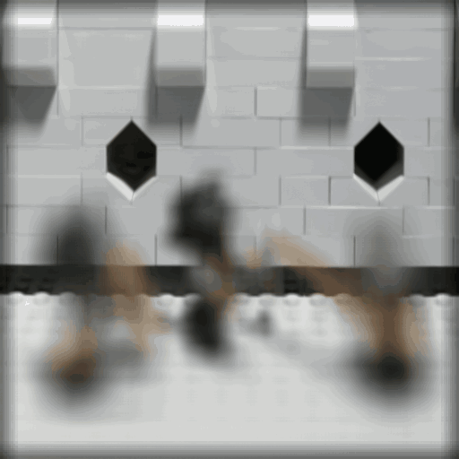

# Light Field Imaging

This small project is mainly based on previous work on Light Field Rendering by [Marc Levoy](https://graphics.stanford.edu/~levoy/) and [Ren Ng](https://graphics.stanford.edu/~renng/). This includes a view-based reconstruction, digital refocusing and dynamic aperture change
The C++ implementation of this project is GPU-accelerated and was built on top of [Qulkan](https://github.com/WeiPhil/qulkan).

## C++ Implementation

To build the C++ code you will need the libpng library on your computer, a c++ compiler of course and cmake. It has been tested on Mac and Linux only. If you run in any problem please let me know. 
To compile and run follow these instructions:

    cd lightfield_viewer
    mkdir build && cd build
    cmake ..
    make -j
    ./Qulkan

## Python implementation:
In the notebook `light_field.ipynb` you will find some applications of light field reconstructions including:
* View-Based resonstruction
* Digital Refocusing
* Digital Aperture change (Better than the C++ version which is limited to integer shift for now)

## Data-set
All the data used in this notebook are from the lightfield database from the Stanford University http://lightfield.stanford.edu/lfs.html

## Assumptions
We assume all the data to be well aligned and cropped. Every lense array is square.

### Digital Aperture example

### Digital Refocusing example

